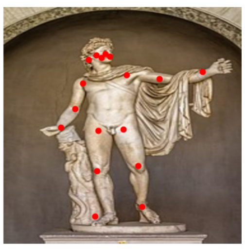
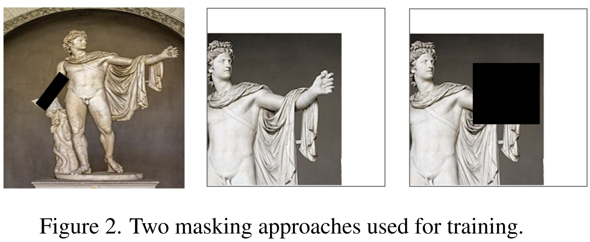
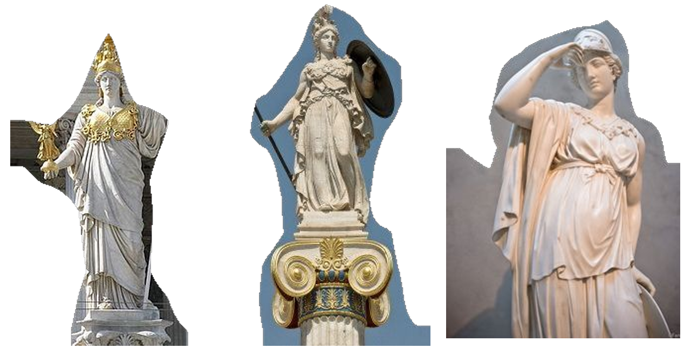
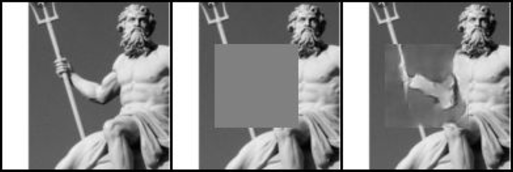
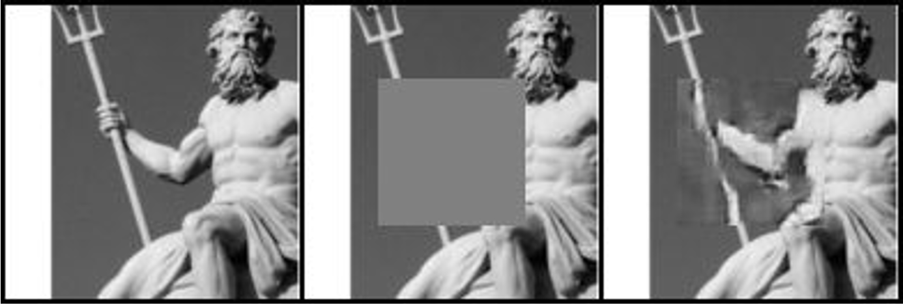

# Restoration-of-Damaged-Statues-with-Inpainting

This project focuses on restoring damaged Greek statues, specifically targeting reconstructing missing arms through advanced deep-learning techniques. Our approach leverages image inpainting and 3D reconstruction to restore the statues with high accuracy and realism.

## Methodology
### 1. Data Preparation
Data Collection: We collected a Greek sculpture dataset and supplemented it with various human body datasets to enhance model generalization.
Pose Estimation: Used Movenet for joint annotations to filter and retain images with visible arms.\

Arm Masking: Applied two strategies to mask arms, ensuring the model learns to inpaint these regions effectively.

Segmentation: Implemented BodyPix for human body segmentation, isolating relevant features and eliminating background noise.

### 2. Image Inpainting
U-Net: Initially employed for inpainting, providing a baseline performance with some artifacts and blurring.
GANs: Implemented Generative Adversarial Networks (GANs) to enhance the quality of inpainted regions, resulting in sharper and more realistic reconstructions.

### 3. 3D Reconstruction
Dust3R: Used for generating 3D models from inpainted 2D images, enabling a complete restoration of the sculptures in three dimensions. Noted that the quality of input images significantly impacted the 3D reconstruction outcomes.

### Results
Image Inpainting: GANs outperformed U-Net, delivering more visually coherent results.

.PNG)

3D Reconstruction: Dust3R provided accurate 3D reconstructions when high-quality images were used, but struggled with lower-quality inputs.

### Conclusions
This project successfully demonstrated the potential of combining inpainting and 3D reconstruction techniques to restore damaged statues. Future work could focus on enhancing the realism of inpainted areas and improving 3D reconstruction quality.

### Acknowledgments
This project was inspired by ongoing efforts in digital heritage preservation, including the work of the Institute for Digital Archaeology and other related studies.
